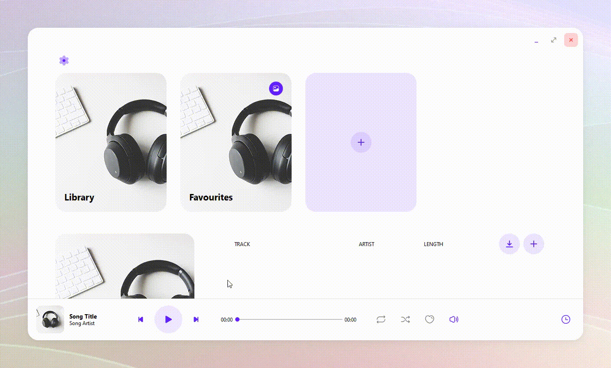
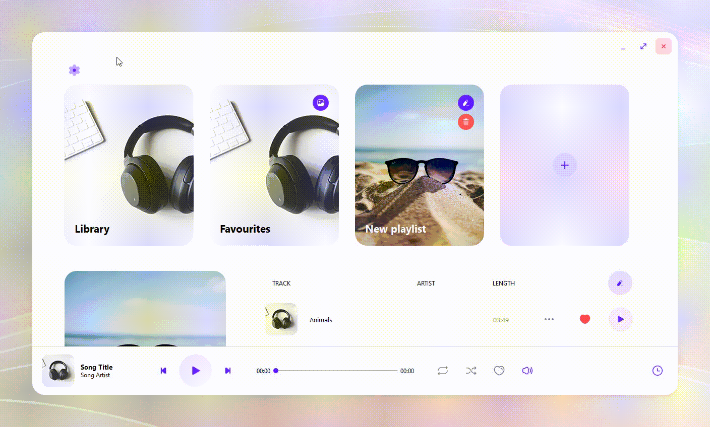

<h1 align="center">
    Meelody
</h1>

    A music player created with PyQt5

## Features

- Play music with options and in mini player screen.

  

- Download songs from YouTube.

  

- Import song and change its meta data.

  

- Manage playlists

  

- Change application theme (Light/Dark) and language (English/Vietnamese)

  

## Installation

1. Download application via releases: [Meelody Release](https://github.com/Ananta0810/Meelody/releases).
2. Install the downloaded execution file.
3. Enjoy the application.

### Known Issues

1. Import more than 20 songs at once may lead to crash in some devices.
