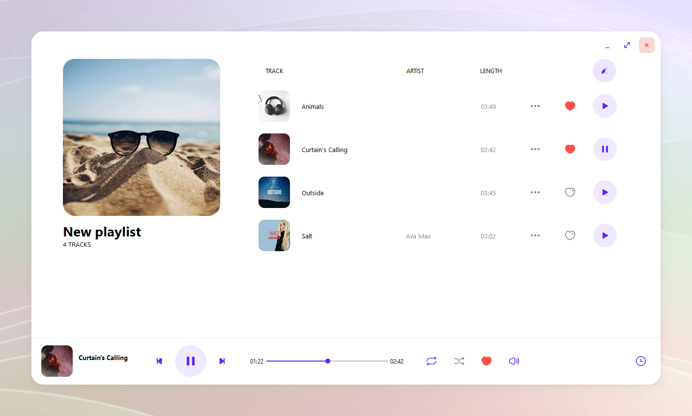

<h1 align="center">
    Meelody
</h1>

    A music player created with PyQt5

## Features

- Import and play local songs

  

- Download songs on YouTube

  

- Edit song meta data

  

- Manage playlists

  

## Installation

1. Download following
   file: [Meelody](https://drive.google.com/file/d/1HScwy2rGNzWGNhqB4dPUhAexL03BHcEa/view?usp=sharing).
2. Extract the file and move the extracted folder to any place you want.
3. Open file Meelody.exe inside to open application.

### Known Issues

1. Sometimes the application takes a long time to start.
2. Download music from YouTube might be failed sometimes due to version changes.
3. The settings to change theme and language is not added.
